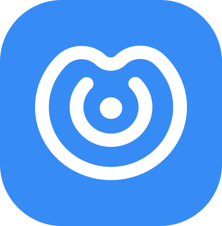
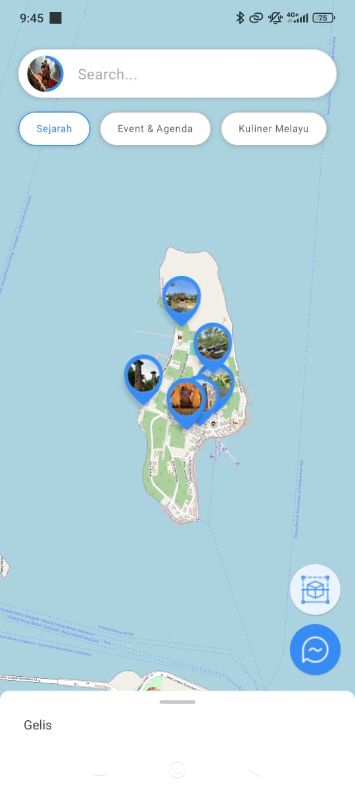
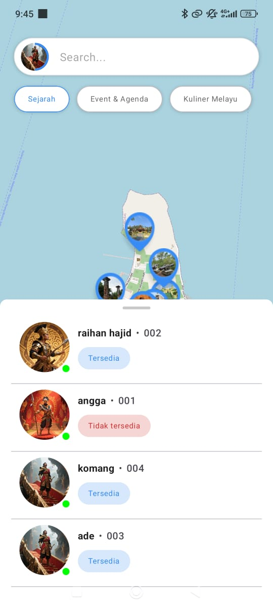
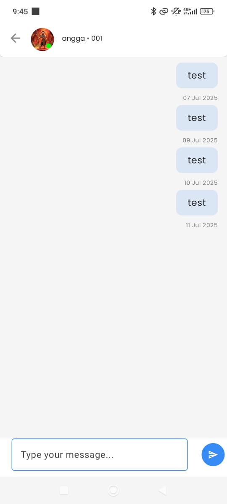
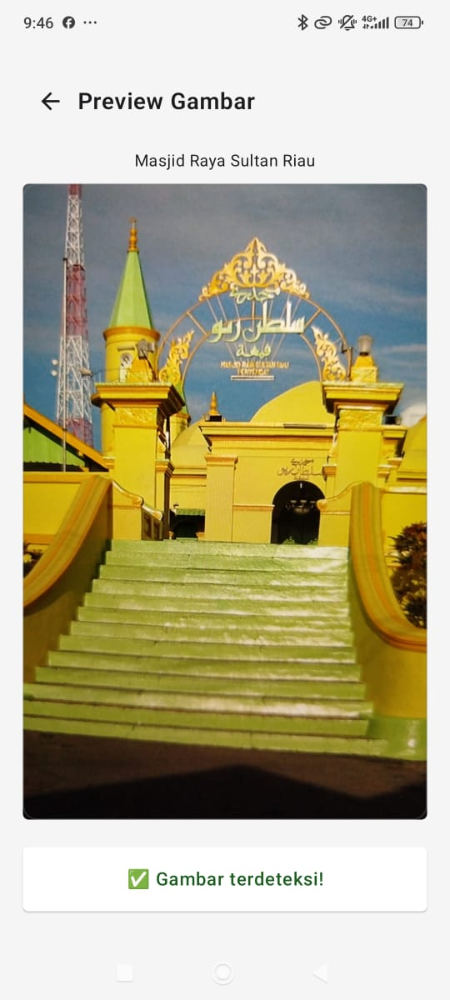
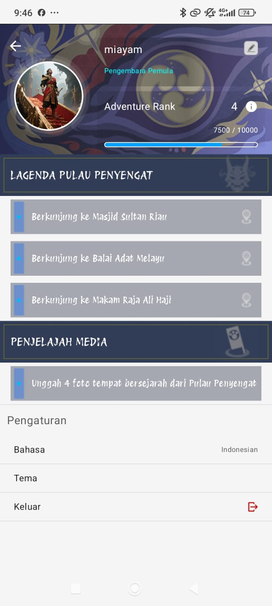

# Nuswapada · Capstone Project Infinite Learning 2025

  

## 🌟 Tentang Kami

**Nuswapada** adalah tim kolaborasi lintas bidang dari program AI dan Mobile Development di Infinite Learning 2025.  
Kami memiliki misi untuk mendukung digitalisasi pariwisata lokal melalui teknologi berbasis kecerdasan buatan.

---

## 📱 Produk: PELOR (Penyengat Explorer)

**PELOR** adalah aplikasi petualangan berbasis gamifikasi yang dirancang untuk memperkenalkan Pulau Penyengat kepada generasi muda melalui eksplorasi interaktif.  
Menggabungkan teknologi **AI image classifier** dan sistem misi (quest), pengguna diajak menjelajahi landmark bersejarah, memvalidasi kunjungan melalui foto, dan mendapatkan poin serta badge.

---

## 🎯 Fitur Unggulan

- 🔍 **AI Landmark Detection** – Validasi kunjungan dengan mengunggah foto, didukung AI klasifikasi gambar.
- 🗺️ **Eksplorasi Peta Interaktif** – Petakan dan jelajahi lokasi-lokasi penting di Pulau Penyengat.
- 💬 **Chat** – Merupakan fitur chat untuk pesan becak motor Gelis.
- 🎖️ **Leveling & Badge System** – Dapatkan pengalaman dan pencapaian dari setiap landmark yang dikunjungi.
- 🧭 **Mode Quest / Petualangan** – Ikuti misi unik yang memberikan edukasi dan hiburan.

---

## 🖼️ Cuplikan Aplikasi

### 🗺️ Halaman Home - Peta Eksplorasi Pulau Penyengat  

### 📇 Halaman Kontak  

### 💬 Fitur Chat  

### 🔍 Halaman Prediksi  

### 🧑‍💼 Halaman Profil  

---

## 🧠 Teknologi yang Digunakan

| Stack | Teknologi |
|-------|-----------|
| **Frontend** | Android (Jetpack Compose) |
| **Backend** | Python FastAPI |
| **AI Model** | Image Classification dengan TensorFlow |
| **Deployment** | Huggingface Space + Render |
| **Tools** | Figma, Git, Colab, Android Studio |

---

## 👨‍👩‍👧‍👦 Anggota Tim Nuswapada

Kami terdiri dari 10 orang dengan latar belakang berbeda dari divisi **Mobile Development** dan **AI Development** Kampus Merdeka Mandiri Batch 8 Infinite Learning 2025.

| Nama | Peran | LinkedIn |
|------|-------|----------|
| Vinsensius Fendy Kurniawan | ML Engineer, MLOps, Project Manager | [LinkedIn](https://www.linkedin.com/in/vinsensius-fendy-kurniawan-86ab50293) |
| Nabilah Putri Wijaya | Machine Learning Engineer | [LinkedIn](https://www.linkedin.com/in/nabilah-putri-wijaya-52b2bb291/) |
| Ilham Akbarian | Mobile Developer | [LinkedIn](https://www.linkedin.com/in/ilham-akbarian-06712436a) |
| Ade Alrizal | Mobile Developer | [LinkedIn](https://www.linkedin.com/in/ade-alrizal-715899345) |
| Angga Kurniawan | Scrum Master, Android Lead | [LinkedIn](https://www.linkedin.com/in/angga-kurniawan-376a7620b) |
| Putri Maharani | UI/UX Designer | [LinkedIn](http://linkedin.com/in/putri-maharani-b78257284) |
| Andhika Laksamana Putra Alka | Design Researcher | [LinkedIn](https://www.linkedin.com/in/andhika-laksmana-putra-alka/) |
| Syahana Arman | Data Engineer | [LinkedIn](https://www.linkedin.com/in/syahanaarman) |
| Muhammad Rahmananda Arief Wibisono | Data Engineer | [LinkedIn](https://www.linkedin.com/in/muhammadrahmanandaariefwibisono/) |
| Komang | Mobile Developer | _(belum tersedia)_ |

---

## 📍 Lokasi Wisata: Pulau Penyengat

Pulau Penyengat adalah destinasi wisata sejarah dan budaya yang terletak di Provinsi Kepulauan Riau, Indonesia.  
Melalui aplikasi ini, kami berharap dapat memperkenalkan nilai historis dan kearifan lokal kepada generasi muda melalui pendekatan yang lebih engaging dan modern.

---

## 📫 Kontak Kami

Untuk informasi lebih lanjut atau kolaborasi:

📧 Email: [nuswapada5@gmail.com]  

---

> *“Bertualang sambil belajar sejarah? Kenapa tidak! Jelajahi Pulau Penyengat bersama PELOR sekarang juga!”*
